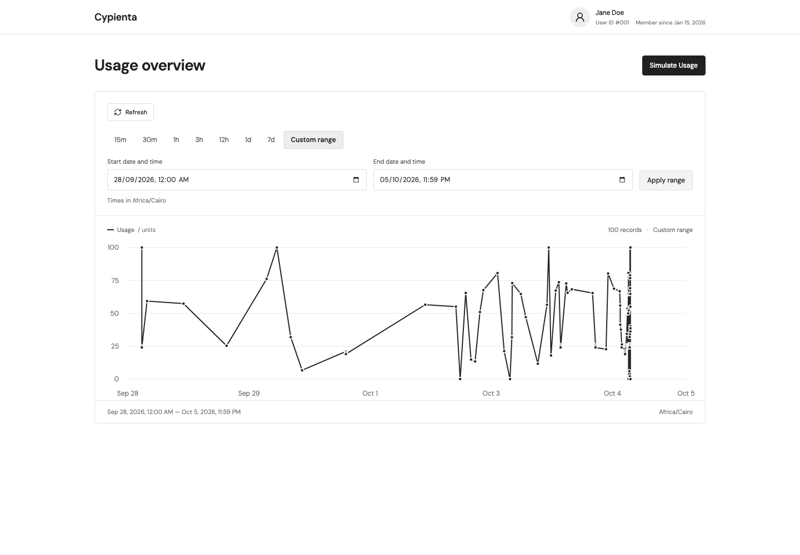
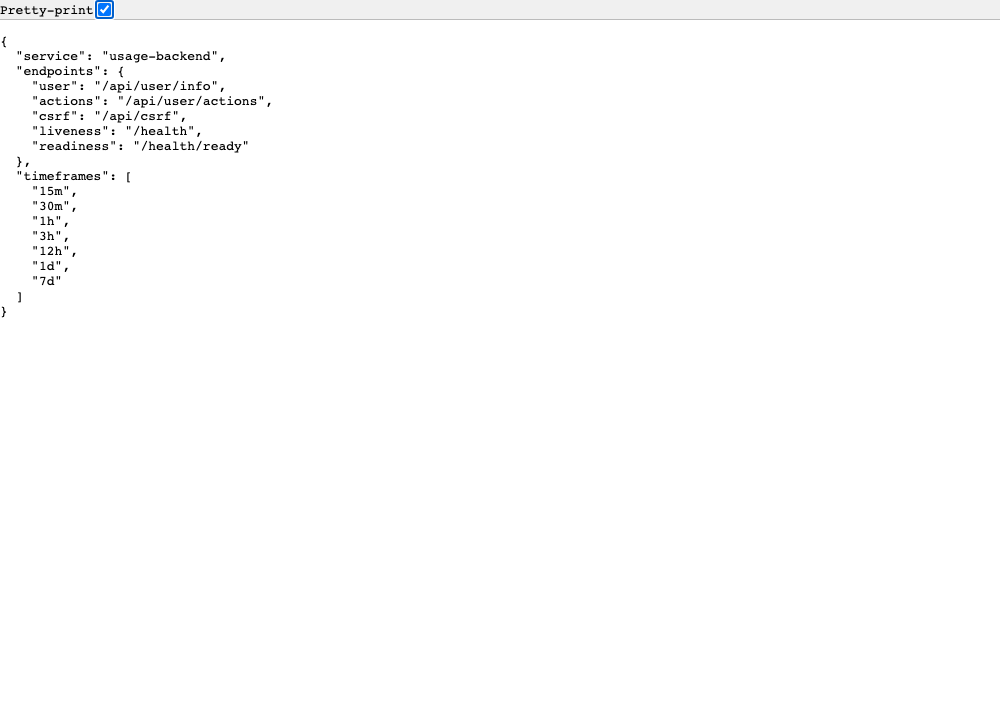

# Cypienta usage dashboard

[](https://github.com/7ganam/cypienta-task/actions/workflows/ci.yml)

A React + TypeScript dashboard with a Django backend for the Cypienta Interview
API. It displays the user's profile and usage history, creates usage records,
and filters the chart by preset or custom date ranges. A separate local mock
makes the demo and tests runnable without the private interview API key.

This guide is a starting point for reviewing the submission: run the app, follow
the request flow, and use the requirement map below to inspect each part.

An [app walkthrough video](app-demo.mov) is included in the repository root.



Captured from the running Docker application with seeded local mock data.
A [backend screenshot](docs/screenshots/backend.png) is included at the end.

## Repository tour

```text
apps/
  web/                 React + TypeScript dashboard and server-side API proxy
  usage-backend/       Django API, upstream client, validation, and time filtering
    bruno/             Backend requests and response assertions
    k8s/               Deployment, Service, Secret template, and Kustomize config
  mock-cypienta-api/   Standalone local API with JSON-file persistence
.github/workflows/     GitHub Actions checks and Docker integration tests
k8s/demo/              Full dashboard deployment for Docker Desktop Kubernetes
docs/screenshots/      Frontend and backend screenshots
app-demo.mov           App walkthrough recording
```

```text
Browser → web /api/* proxy → Django → Cypienta Interview API or local mock
```

Django owns upstream authentication, response validation, UTC filtering, and
record sorting. The frontend renders the result and manages refreshes. Records
are stored by the upstream API; the wrapper needs no database or migrations.
The upstream API key stays in Django and is never sent to the browser.

For a short code tour, start with [the dashboard](apps/web/src/components/dashboard.tsx),
follow [the web proxy](apps/web/src/server/usage-backend.ts), then read Django's
[views](apps/usage-backend/usage/views.py), [services](apps/usage-backend/usage/services.py),
and [upstream client](apps/usage-backend/usage/client.py).

## Get started with Docker Compose

Requires Docker with Compose v2. Node.js and Python are not needed on the host.

```sh
git clone https://github.com/7ganam/cypienta-task.git
cd cypienta-task
docker compose up --build --detach --wait
```

Open **http://localhost:8000**. The defaults start the web app, Django, and the
local mock. No `.env` file or private key is needed. Plain `docker compose up`
also builds and starts the stack on a clean checkout.

| App            | Address                  | Purpose                                    |
| -------------- | ------------------------ | ------------------------------------------ |
| Dashboard      | `http://localhost:8000`  | Review the UI and simulate usage           |
| Django backend | `http://127.0.0.1:41873` | Inspect JSON endpoints and use API clients |
| Local mock     | `http://127.0.0.1:40759` | Inspect the upstream substitute directly   |

History starts empty. Click **Simulate Usage**, or add the screenshot's sample data:

```sh
docker compose exec mock-cypienta-api python manage.py seed_usage --count 100 --days 7
```

Refresh the dashboard after seeding. Seeding adds records; it does not replace
existing history. Mock records persist in the `mock-data` volume.

```sh
docker compose ps
docker compose logs --tail=50 usage-backend
docker compose down
```

`down` preserves mock records. `docker compose down --volumes` also deletes them.

To use the real interview API, copy `.env.example` to a root `.env`, set
`API_URL=http://139.177.194.233:5000` and `API_KEY` to the supplied private key,
then start the two application services:

```sh
docker compose up --build --detach --wait usage-backend web
```

## Get started in development mode

Requires Node.js **22.12+** (Node 24 is used in CI), pnpm **10.4.1**, and Python
**3.12+** with `venv` and `pip`. Stop the root Docker stack before using the
standard dev ports: both modes use ports 41873 and 40759.

From the repository root:

```sh
pnpm install --frozen-lockfile
pnpm run setup
cp apps/usage-backend/.env.example apps/usage-backend/.env
pnpm dev
```

Open **http://127.0.0.1:3000**. `setup` creates each Python app's virtual
environment and installs its dependencies, including backend test/lint tools.
`dev` starts the mock, Django, and the web dev server together. The copied
backend example selects the local mock and its `local-dev-key`.

To use the real API, edit `API_URL` and `API_KEY` in `apps/usage-backend/.env`
and restart Django. The web app still talks to Django at the same address.
Web and mock `.env` files are optional for the default local configuration.

Stop with Ctrl+C. `pnpm dev:down` from another terminal stops this checkout's
native dev servers. To add sample data in dev mode:

```sh
apps/mock-cypienta-api/.venv/bin/python apps/mock-cypienta-api/manage.py seed_usage --count 100 --days 7
```

More detail: [web](apps/web/README.md), [Django](apps/usage-backend/README.md),
and [local mock](apps/mock-cypienta-api/README.md).

## Environment variables

| Mode / app         | Configuration file                                                                            | Reader                                           |
| ------------------ | --------------------------------------------------------------------------------------------- | ------------------------------------------------ |
| Root Docker stack  | `.env`, copied from [`.env.example`](.env.example)                                            | Docker Compose                                   |
| Django in dev mode | `apps/usage-backend/.env`, copied from [its example](apps/usage-backend/.env.example)         | Django settings                                  |
| Web in dev mode    | `apps/web/.env`, copied from [its example](apps/web/.env.example)                             | Vite; the production start command also reads it |
| Mock in dev mode   | `apps/mock-cypienta-api/.env`, copied from [its example](apps/mock-cypienta-api/.env.example) | Mock launcher                                    |

The root `.env` is for Compose; it does not configure native dev servers.
Exported variables override Django's `.env` values.

| Variable               | Purpose                                   | Local configuration                                                                                       |
| ---------------------- | ----------------------------------------- | --------------------------------------------------------------------------------------------------------- |
| `API_URL`              | Django's upstream API base URL            | Dev: `http://127.0.0.1:40759`; Compose: `http://mock-cypienta-api:40759`                                  |
| `API_KEY`              | Django sends this as upstream `X-API-Key` | `local-dev-key` for the mock; the supplied private key for the real API                                   |
| `BACKEND_URL`          | Web server's Django address               | Dev: `http://127.0.0.1:41873`; Compose sets `http://usage-backend:8000`                                   |
| `API_TIMEOUT_SECONDS`  | Upstream request timeout                  | `10`                                                                                                      |
| `MOCK_API_KEY`         | Key accepted by the native mock           | `local-dev-key`; must match Django's key when using the mock                                              |
| `MOCK_API_PORT`        | Native mock listening port                | `40759`                                                                                                   |
| `DJANGO_SECRET_KEY`    | Django signing secret                     | Optional in local dev/demo; production and Kubernetes require a generated value of at least 50 characters |
| `DJANGO_ALLOWED_HOSTS` | Hostnames accepted by Django              | Local defaults and Compose values are provided; configure explicitly for deployment                       |

Keep the real upstream key in Django's configuration. Actual `.env` files and real credentials
are excluded from Git. See [production settings](apps/usage-backend/README.md#production-settings)
for HTTPS and proxy configuration.

## Bruno / Postman setup

### Bruno

1. Start the app using Compose or dev mode.
2. Choose **Open Collection** and select
   [`apps/usage-backend/bruno/`](apps/usage-backend/bruno), the folder containing `bruno.json`.
3. Select the **local** collection environment. `base_url` is
   `http://127.0.0.1:41873`, which works for either startup mode.
4. Send **Setup → Health Check**, then **Setup → Get CSRF Token** before sending
   POSTs individually. The CSRF request stores the token and cookie automatically.
5. Try **User → Get User Info**, **Add Usage Record**, and **Get Usage History**.
   Custom ranges, all seven presets, and error cases are also included.

Run the whole collection against the local mock from the CLI:

```sh
cd apps/usage-backend/bruno
pnpm --package=@usebruno/cli@4.2.0 dlx bru run --env local
```

The run creates one mock record and verifies responses. The backend collection
needs no `X-API-Key` header: Django obtains that key from its environment.
To inspect the upstream substitute directly, open the separate
[mock Bruno collection](apps/mock-cypienta-api/bruno), select **local**, and use
port 40759 with `X-API-Key: local-dev-key`.

### Postman

Import the checked-in [Postman user collection](apps/mock-cypienta-api/usage_api/fixtures/postman_user_collection.json).
It targets the mock/upstream directly. Collection variables default to
`base_url=http://127.0.0.1:40759` and `user_api_key=local-dev-key`. Run **Health
Check**, **Get User Info**, **Add Usage Record**, then **Get Usage History**.
For the real upstream, change those two variables to the interview URL and key.

To inspect the **Django wrapper**, use port **41873** and **No Auth**:

1. Send `GET http://127.0.0.1:41873/api/csrf`. Copy the JSON `csrfToken`.
   Leave Postman's cookie jar enabled to retain the `csrftoken` cookie.
2. Send `POST http://127.0.0.1:41873/api/user/actions` with raw JSON
   `{"usage":42.7}`, `Content-Type: application/json`, and `X-CSRFToken`
   containing the copied token. Expect **201**.
3. Send `GET http://127.0.0.1:41873/api/user/actions?timeframe=15m` and find
   the new record. Use the same hostname for all three requests.

POST requests in either client create records. Bundled local configurations
are intended for the mock; real upstream calls use the credentials you supply.

## Main commands

Run from the repository root unless a command changes directory:

| Command                                                                  | Purpose                                                               |
| ------------------------------------------------------------------------ | --------------------------------------------------------------------- |
| `docker compose up --build --detach --wait`                              | Build/start the Docker demo at port 8000                              |
| `docker compose down`                                                    | Stop the Docker demo                                                  |
| `pnpm run setup`                                                         | Install Python dependencies and backend test/lint tools               |
| `pnpm dev`                                                               | Run all three apps; web at port 3000                                  |
| `pnpm dev:web` / `pnpm dev:usage-backend` / `pnpm dev:mock-cypienta-api` | Run one app                                                           |
| `pnpm dev:down`                                                          | Stop this checkout's native dev servers                               |
| `pnpm build`                                                             | Build the web Node server and generate TanStack route types           |
| `pnpm typecheck`                                                         | Check TypeScript; build first on a fresh checkout                     |
| `pnpm lint`                                                              | Check backend lint/formatting and frontend formatting                 |
| `pnpm test`                                                              | Run Django backend, mock, and frontend unit tests                     |
| `pnpm test:e2e`                                                          | Run browser tests; install Chromium first                             |
| `pnpm start`                                                             | Run the built web server at port 3000; Django must also be running    |
| `python3 apps/usage-backend/scripts/smoke_test.py`                       | Check a running backend, CSRF, creation, filtering, and record reread |

Install Chromium once, then run browser tests:

```sh
pnpm --filter ./apps/web exec playwright install chromium
pnpm test:e2e
```

Most browser tests intercept API responses to cover the UI deterministically.
Enable the full-stack test separately against the local mock; it creates a record:

```sh
# With the Docker demo running:
E2E_BASE_URL=http://127.0.0.1:8000 E2E_LIVE_BACKEND=1 pnpm test:e2e

# With pnpm dev running against the mock:
E2E_LIVE_BACKEND=1 pnpm test:e2e
```

## Challenge requirements: solution and inspection guide

### Part 1 — Application and tests

| Required point                               | My solution                                                                                                                                                                                | How to inspect                                                                                                                                                                                                                             |
| -------------------------------------------- | ------------------------------------------------------------------------------------------------------------------------------------------------------------------------------------------ | ------------------------------------------------------------------------------------------------------------------------------------------------------------------------------------------------------------------------------------------ |
| Django backend handles data processing       | Django validates input/upstream responses, resolves UTC windows, filters returned records, and sorts history. Views call services, then an HTTPX client.                                   | Read [views](apps/usage-backend/usage/views.py), [services](apps/usage-backend/usage/services.py), [client](apps/usage-backend/usage/client.py), and [validation](apps/usage-backend/usage/validation.py). Open backend `/` for discovery. |
| Display user info                            | The dashboard displays the name, user ID, and creation date from `GET /api/user/info`.                                                                                                     | Compare the dashboard header with `http://127.0.0.1:41873/api/user/info`. See [dashboard.tsx](apps/web/src/components/dashboard.tsx).                                                                                                      |
| Simulate random usage from 0–100 and refresh | The button generates a value, obtains CSRF, POSTs through Django, and refreshes profile/history after success. POSTs are not automatically retried.                                        | Click **Simulate Usage**, inspect the POST in DevTools, and reread history. See [API helpers](apps/web/src/lib/api.ts), [usage helpers](apps/web/src/lib/usage.ts), and [browser tests](apps/web/tests/e2e/dashboard.spec.ts).             |
| Visualize usage history                      | Recharts plots records chronologically with usage/datetime tooltips and explicit empty, loading, and error states.                                                                         | Hover over points and compare with `GET /api/user/actions`. See the chart in [dashboard.tsx](apps/web/src/components/dashboard.tsx).                                                                                                       |
| Seven presets and a custom datetime range    | **15m, 30m, 1h, 3h, 12h, 1d, 7d** presets; custom local datetime inputs validate ordering and submit ISO UTC bounds on **Apply range**. Django uses inclusive bounds.                      | Try each filter; inspect `timeframe` or `start_date`/`end_date` in DevTools. Read [filters.py](apps/usage-backend/usage/filters.py) and [range helpers](apps/web/src/lib/usage.ts).                                                        |
| Backend endpoint tests                       | Coverage includes endpoints, numeric/JSON validation, date ranges, CSRF, upstream failures, health probes, sorting, and secret redaction. Controlled HTTP transport avoids real API calls. | Run `pnpm test:usage-backend`; read [test_api.py](apps/usage-backend/usage/tests/test_api.py). `pnpm test` also checks mock/frontend code; CI enables all 11 browser tests against Docker.                                                 |

### Part 2 — Docker

Runnable Dockerfiles exist for [web](apps/web/Dockerfile),
[Django](apps/usage-backend/Dockerfile), and [mock](apps/mock-cypienta-api/Dockerfile).
The root [docker-compose.yml](docker-compose.yml) connects them, publishes the
site at **http://localhost:8000**, and supplies `API_URL` / `API_KEY` through
variables. The default mock makes the clean-machine demo independent of private
credentials. Django runs non-root with a read-only filesystem and health checks.

**Inspect:** run the Docker quickstart and `docker compose ps`, then compare API
responses with the UI. A [backend-only Compose file](apps/usage-backend/docker-compose.yml)
is available when only Django is needed.

### Part 3 — Kubernetes

Required manifests live in [`apps/usage-backend/k8s/`](apps/usage-backend/k8s):

| Required point                                | My solution                                                                                                                                                                            | How to inspect                                                                                                                                                                                 |
| --------------------------------------------- | -------------------------------------------------------------------------------------------------------------------------------------------------------------------------------------- | ---------------------------------------------------------------------------------------------------------------------------------------------------------------------------------------------- |
| Deployment, replicas, probes, requests/limits | Two replicas; startup/readiness/liveness probes; CPU/memory requests **100m / 128Mi**, limits **500m / 256Mi**. Non-root containers have writable `/tmp`.                              | Read [deployment.yaml](apps/usage-backend/k8s/deployment.yaml). Liveness uses `/health`; readiness checks the upstream through `/health/ready`.                                                |
| Service                                       | Stable internal address for backend replicas.                                                                                                                                          | Read [service.yaml](apps/usage-backend/k8s/service.yaml).                                                                                                                                      |
| API key Secret; optional API URL ConfigMap    | Secret holds `API_KEY` and `DJANGO_SECRET_KEY`; Kustomize generates the URL ConfigMap. The checked-in Secret is a placeholder; guides create populated Secrets from private env files. | Read [secret.yaml](apps/usage-backend/k8s/secret.yaml), [kustomization.yaml](apps/usage-backend/k8s/kustomization.yaml), and the [backend deployment guide](apps/usage-backend/k8s/README.md). |

The optional full dashboard deployment is in [`k8s/demo/`](k8s/demo). Its
[Docker Desktop guide](k8s/demo/README.md) covers image builds, real upstream
credentials, deployment, and opening the UI at port **8080**. A running cluster
is optional; the manifests can be reviewed without starting one.

### Part 4 — CI

[GitHub Actions](https://github.com/7ganam/cypienta-task/actions/workflows/ci.yml)
runs on pushes, pull requests, and manual dispatch. The
[workflow](.github/workflows/ci.yml) has two jobs:

- **Python checks:** install locked dependencies; run Ruff, Django checks,
  backend tests, and mock tests.
- **Web and Docker integration:** build the frontend, check TypeScript and
  formatting, run unit tests, build/start all three Docker images, run an HTTP
  smoke test, and run browser tests including a saved-record reread.

**Inspect:** open a successful run and expand either job. Download `ci-results`
for browser reports, screenshots, and container logs. CI needs no private API
key. Artifacts are kept for seven days; the repository screenshots remain available.

### Part 5 — Debugging

The primary [backend DEBUGGING.md](apps/usage-backend/DEBUGGING.md) documents the
Kubernetes crash loop caused by a Django secret shorter than the production
minimum. It records the symptom, investigation through events/previous logs,
root cause, fix, and prevention. The fix generates a key of at least 50 characters
and updates the Kubernetes Secret.

A second [web DEBUGGING.md](apps/web/DEBUGGING.md) describes an environment-loading
bug that turned JavaScript `undefined` into an invalid backend URL string.

**Inspect:** read the reports with the [production settings](apps/usage-backend/config/settings/production.py)
or [Vite configuration](apps/web/vite.config.ts). The backend report distinguishes
the configuration fix from a verified cluster rollout.

### Part 6 — Submission material

- **Repository:** [github.com/7ganam/cypienta-task](https://github.com/7ganam/cypienta-task).
- **Source ZIP:** [download main](https://github.com/7ganam/cypienta-task/archive/refs/heads/main.zip).
  Includes source, tests, Docker/Kubernetes files, CI, guides, debugging reports,
  screenshots, and the walkthrough video.
- **Video:** [app walkthrough recording](app-demo.mov), also included in the source ZIP.
- **Frontend/backend evidence:** [dashboard](docs/screenshots/dashboard.png) and
  [Django API](docs/screenshots/backend.png), captured from the running local Docker demo.
- Dependencies, virtualenvs, local credentials, private challenge inputs, and
  generated build output are excluded from Git and the source ZIP.


